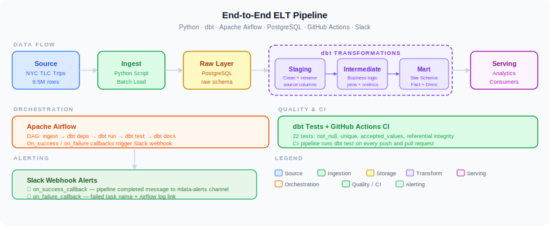

# NYC Taxi ELT Pipeline: dbt & Apache Airflow

End-to-end ELT pipeline ingesting NYC TLC yellow taxi trip data into PostgreSQL, transforming with dbt (staging → intermediate → dimensional mart), orchestrated with Apache Airflow, validated with 22 dbt tests, and monitored with Slack alerts.

## Architecture



The pipeline ingests 9.5M rows of NYC TLC trip data via Python into PostgreSQL, transforms it with dbt across three layers (staging → intermediate → dimensional mart with star schema), orchestrates the full workflow with Apache Airflow DAGs, and enforces data quality with 22 passing dbt tests and CI via GitHub Actions.

## Tech Stack

| Layer | Tool |
|-------|------|
| Orchestration | Apache Airflow 2.9 |
| Transformation | dbt 1.8 + dbt_utils |
| Warehouse | PostgreSQL 15 (local via Docker) |
| Ingestion | Python (requests, pandas, SQLAlchemy) |
| Data Quality | dbt tests (not_null, unique, accepted_values, relationships) |
| Alerting | Slack Incoming Webhooks (on_success / on_failure callbacks) |
| CI/CD | GitHub Actions |
| Containerization | Docker + Docker Compose |

## DAG

5-task pipeline running daily at 6am UTC:

```
ingest_raw_data → dbt_deps → dbt_run → dbt_test → dbt_docs_generate
```

Airflow `on_success_callback` and `on_failure_callback` fire Slack webhook messages after every run. Success posts a completion summary; failure posts the failed task name and a direct link to the Airflow log.

Add your webhook URL to `.env` before starting:
```bash
SLACK_WEBHOOK_URL=https://hooks.slack.com/services/...
```

## Project Structure

```
nyc-taxi-elt-pipeline/
├── ingestion/
│   └── download_trips.py          # Download parquet files, load to PostgreSQL raw schema
├── dags/
│   └── nyc_taxi_pipeline.py       # Airflow DAG
├── dbt_project/
│   ├── dbt_project.yml
│   ├── packages.yml               # dbt_utils dependency
│   ├── profiles.yml               # PostgreSQL connection (host: postgres for Docker)
│   └── models/
│       ├── staging/
│       │   ├── stg_trips.sql      # Clean, cast, filter, deduplicate raw trips
│       │   └── schema.yml
│       ├── intermediate/
│       │   └── int_trips_enriched.sql   # Derived metrics and time dimensions
│       └── marts/
│           ├── fct_trips.sql      # Fact table (8.5M rows) with surrogate key + dedup
│           ├── dim_date.sql       # Date dimension (366 rows, full 2024)
│           └── schema.yml         # 22 data tests
├── docs/
│   └── architecture.svg           # Architecture diagram
├── .github/workflows/
│   └── dbt_ci.yml                 # CI: lint + dbt build on push
├── Dockerfile                     # Custom Airflow image with dbt + psycopg2
├── docker-compose.yml             # Airflow + PostgreSQL + shared log volume
└── .env.example                   # Environment variable template
```

## Data Model

```
fct_trips (8,550,224 rows)
├── trip_id (PK — surrogate key)
├── date_id (FK → dim_date)
├── pickup_location_id
├── dropoff_location_id
├── pickup_at / dropoff_at
├── trip_duration_minutes
├── trip_distance_miles
├── passenger_count
├── fare_amount / tip_amount / total_amount
├── tip_pct / fare_per_mile
├── pickup_hour / day_of_week / is_weekend
└── payment_type_id

dim_date (366 rows — full year 2024)
├── date_id (PK)
├── date, year, month, day
├── month_name, day_name, day_of_week
├── is_weekend, quarter, week_of_year
```

## Data Quality

22 dbt tests — all passing:

- `not_null` on all primary keys and critical fields across staging and marts
- `unique` on trip_id and date_id
- `accepted_values` on payment_type (1–6, excluding unknown type 0)
- `relationships` FK test: every fct_trips.date_id exists in dim_date

## Setup

### Prerequisites

Docker and Docker Compose installed.

### Run locally

```bash
# 1. Clone and enter project
git clone https://github.com/srthakre3/nyc-taxi-elt-pipeline.git
cd nyc-taxi-elt-pipeline

# 2. Start Airflow + PostgreSQL
docker compose up -d

# 3. Open Airflow UI and trigger DAG
open http://localhost:8081
# Enable nyc_taxi_pipeline → trigger manually
```

All 5 tasks run automatically: ingest → dbt deps → dbt run → dbt test → dbt docs.

## Results

- 9.5M raw rows ingested across 3 months of NYC TLC data (Jan–Mar 2024)
- 8.55M clean rows in fct_trips after filtering invalid trips
- 22/22 dbt tests passing
- Pipeline runs end-to-end in under 10 minutes
- Slack alert fires on every run with success summary or failed task + log link
